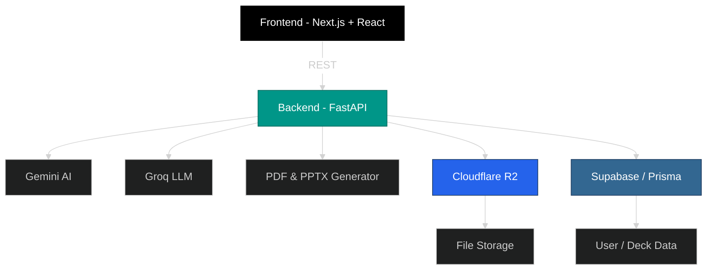
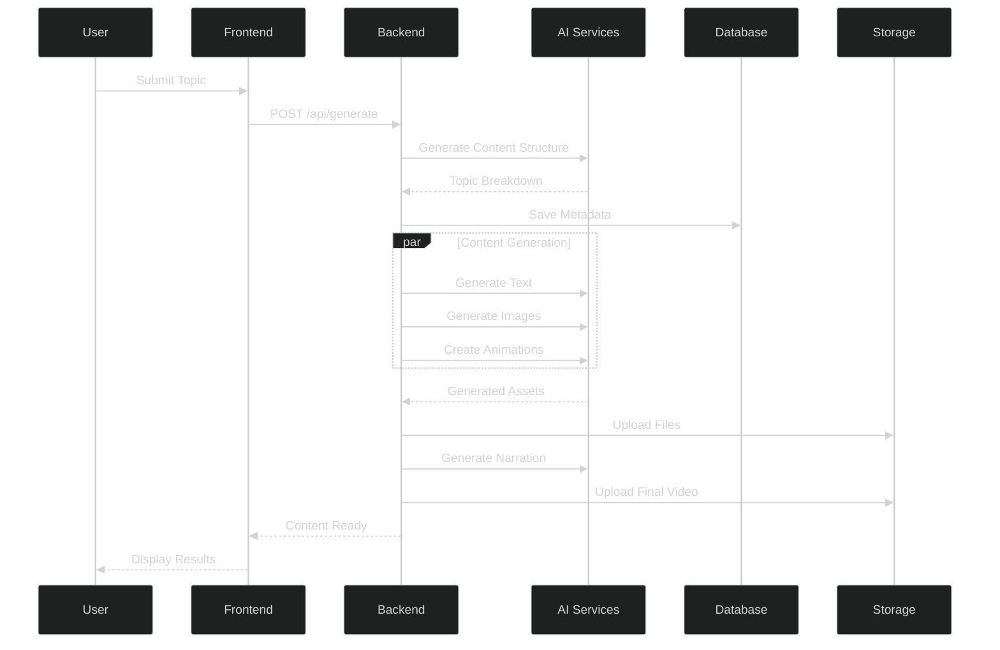

<div align="center">

# 🎓 EduSynth

### AI-Powered Educational Content Generation Platform

**TEAM COGNICODE**
**Varun Aditya**
**Vishwaradhya S Aiholli**
**Tushar P**
**Dia Arora**

[](https://opensource.org/licenses/MIT)
[](https://www.python.org/)
[](https://fastapi.tiangolo.com/)
[](https://nextjs.org/)
[](https://www.typescriptlang.org/)
[](https://reactjs.org/)
[](http://makeapullrequest.com)

**Transform raw topics into comprehensive, interactive educational content with AI-powered animations, voice narration, and intelligent content structuring.**

[Features](#-features) • [Architecture](#-architecture) • [Getting Started](#-getting-started) • [Documentation](#-documentation) • [Contributing](#-contributing)

</div>

---

## 🌟 Features

### 🤖 **AI-Powered Content Generation**

* **Intelligent Topic Parsing**: Automatically breaks down complex topics into digestible subtopics
* **Multi-Modal Content**: Generate text, images, animations, and audio seamlessly
* **Adaptive Learning Paths**: Creates personalized content flows based on learning objectives

### 🎨 **Rich Media Production**

* **Animated Presentations**: Transform static content into engaging animations
* **Text-to-Speech Integration**: Natural voice narration using ElevenLabs
* **Visual Content Synthesis**: AI-generated images and diagrams via Google Gemini
* **Interactive Mind Maps**: Visualize topic relationships with React Flow

### 📚 **Multi-Format Export**

* **Video Lectures**: Complete synchronized video presentations
* **PDF Documents**: Professional-quality study materials
* **PowerPoint Presentations**: Ready-to-use slide decks
* **Interactive Web Content**: Engaging online learning modules

### 🎯 **Smart Content Features**

* **Gamified Learning**: Interactive examples and executable code snippets
* **Prompt-Driven Animations**: Dynamic content that responds to user interactions
* **Contextual Image Fetching**: Relevant visuals automatically matched to content
* **Progress Tracking**: Monitor learning journeys through integrated analytics

---

## 🏧 Architecture

### System Overview



### Technology Stack

<table>
<tr>
<td width="50%">

#### Frontend

* **Framework**: Next.js 16 with App Router
* **UI Library**: React 19.2
* **Styling**: Tailwind CSS 4
* **State Management**: Zustand
* **Data Fetching**: TanStack Query
* **Animations**: GSAP & Framer Motion
* **Visualizations**: React Flow / XYFlow
* **Code Highlighting**: Highlight.js
* **Markdown**: React Markdown with remark-gfm

</td>
<td width="50%">

#### Backend

* **Framework**: FastAPI with Uvicorn
* **Language**: Python 3.11
* **AI/ML**: Google Gemini, Groq
* **Database**: PostgreSQL with Prisma ORM
* **Storage**: Cloudflare R2 (S3-compatible)
* **Auth**: Supabase
* **Media Processing**: MoviePy, Pillow, ReportLab
* **TTS**: ElevenLabs
* **Visualization**: NetworkX, Matplotlib

</td>
</tr>
</table>

---

## 🚀 Getting Started

### Prerequisites

* **Node.js** (v20 or higher)
* **Python** (v3.11)
* **npm**, **yarn**, or **pnpm**
* **PostgreSQL** (v14 or higher)

### Quick Start

```bash
git clone https://github.com/varunaditya27/EduSynth.git
cd EduSynth
```

#### Backend

```bash
cd backend
python -m venv venv
source venv/bin/activate  # Windows: venv\Scripts\activate
pip install -r requirements.txt
cp .env.example .env
npx prisma generate
npx prisma db push
uvicorn app.main:app --reload
```

#### Frontend

```bash
cd ../frontend
npm install
npm run dev
```

* Frontend: [http://localhost:3000](http://localhost:3000)
* Backend: [http://localhost:8000](http://localhost:8000)
* Docs: [http://localhost:8000/docs](http://localhost:8000/docs)

---

## 📖 Documentation

### Project Structure

```
EduSynth/
├── frontend/
│   ├── app/
│   ├── components/
│   ├── contexts/
│   ├── lib/
│   └── public/
│
├── backend/
│   ├── app/
│   │   ├── routers/
│   │   ├── services/
│   │   ├── models/
│   │   ├── schemas/
│   │   └── core/
│   ├── assets/
│   ├── prisma/
│   └── scripts/
│
└── ai_generation/
```

### Content Generation Pipeline



---

## 🎯 Use Cases

* 📚 **Educators**: Quickly generate lectures
* 🎓 **Students**: Personalized study guides
* 💼 **Corporate Training**: Engaging modules
* 🔬 **Researchers**: Visualized concepts
* 🌐 **Creators**: Educational video production

---

## 🤝 Contributing

1. Fork the repository
2. Create a feature branch
3. Commit your changes
4. Push and open a PR 🚀

---

## 📄 License

MIT License - See [LICENSE](LICENSE)

---

## 🙏 Acknowledgments

* Google Gemini
* Groq
* ElevenLabs
* Vercel
* Supabase

---
