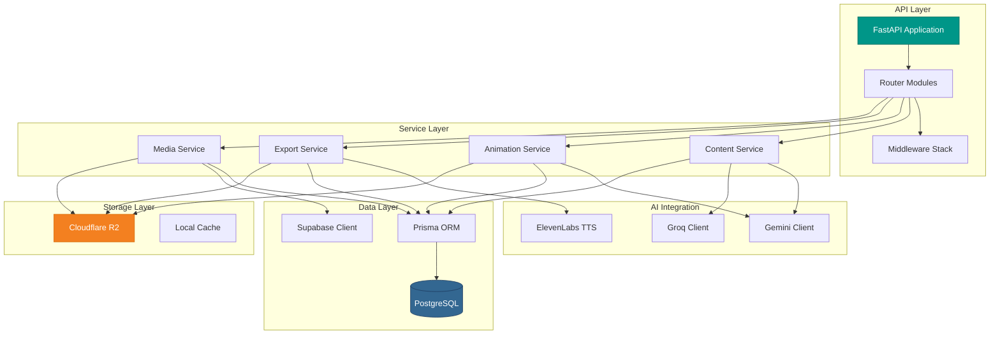
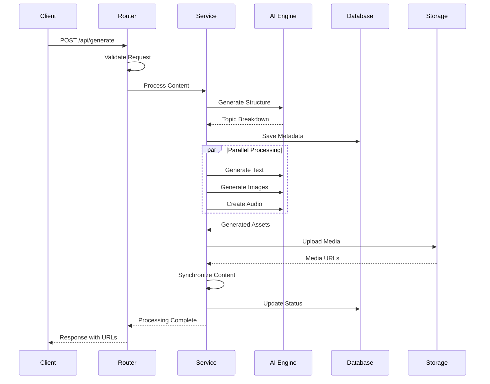

<div align="center">

# ⚙️ EduSynth Backend

### FastAPI-Powered AI Content Generation Engine

[](https://fastapi.tiangolo.com/)
[](https://www.python.org/)
[](https://www.uvicorn.org/)
[](https://www.prisma.io/)
[](https://www.postgresql.org/)
[](https://github.com/psf/black)

**High-performance API server powering intelligent educational content generation with AI, multimedia processing, and real-time content synthesis.**

</div>

---

## 📚 Table of Contents

* [🌟 Features](#-features)
* [🎗️ Architecture](#-architecture)
* [🚀 Getting Started](#-getting-started)
* [📝 API Documentation](#-api-documentation)
* [🗁 Project Structure](#-project-structure)
* [🔧 Configuration](#-configuration)
* [🤪 Testing](#-testing)
* [🚀 Deployment](#-deployment)

---

## 🌟 Features

### 🤖 AI-Powered Generation

* **Multi-Model AI Integration**

  * Google Gemini for content generation and image synthesis
  * Groq LLM for fast inference and text processing
  * Intelligent prompt engineering and content structuring

* **Smart Content Pipeline**

  * Automated topic breakdown and subtopic extraction
  * Context-aware content generation
  * Adaptive learning path creation

### 🎨 Multimedia Processing

* **Video Generation**

  * Synchronized audio-visual content
  * Animated presentations with MoviePy
  * Frame-perfect timing with audio narration

* **Image Processing**

  * AI-generated educational images
  * Dynamic image fetching and optimization
  * Format conversion and compression

* **Audio Synthesis**

  * High-quality TTS with ElevenLabs
  * Multiple voice options
  * Emotion and emphasis control

### 📊 Document Generation

* **PDF Creation**: Professional study materials with ReportLab
* **PowerPoint Export**: Slide decks with python-pptx
* **Mind Maps**: NetworkX-powered visualizations
* **Flowcharts**: Graphviz integration for diagrams

### 🔒 Security & Performance

* **Authentication**: JWT-based auth with bcrypt
* **Rate Limiting**: Request throttling and quota management
* **Async Processing**: Non-blocking I/O operations
* **Caching**: Redis-ready architecture
* **Cloud Storage**: Cloudflare R2 (S3-compatible)

---

## 🎗️ Architecture

### System Architecture



### Request Flow



---

## 🚀 Getting Started

### Prerequisites

```bash
# System Requirements
Python 3.11 or higher
PostgreSQL 14 or higher
pip or poetry

# Optional
Docker & Docker Compose
Redis (for caching)
```

### Installation

1. **Navigate to backend directory**

   ```bash
   cd backend
   ```

2. **Create and activate virtual environment**

   ```bash
   python -m venv venv
   source venv/bin/activate  # On Windows: venv\Scripts\activate
   ```

3. **Install dependencies**

   ```bash
   pip install -r requirements.txt
   ```

4. **Set up environment variables**

   ```bash
   cp .env.example .env
   ```

5. **Initialize database**

   ```bash
   npx prisma generate
   npx prisma db push
   python scripts/seed_db.py
   ```

6. **Run the server**

   ```bash
   uvicorn app.main:app --reload --host 0.0.0.0 --port 8000
   ```

7. **Verify installation**

   * API: [http://localhost:8000](http://localhost:8000)
   * Interactive Docs: [http://localhost:8000/docs](http://localhost:8000/docs)

---

## 📝 API Documentation

See `/docs` or `/redoc` after running the server.

---

## 🔧 Configuration

See `.env.example` for all available variables and tweak them as needed.

---

## 🤪 Testing

```bash
pip install pytest pytest-asyncio pytest-cov httpx
pytest -v --cov=app
```

---

## 🚀 Deployment

```bash
docker build -t edusynth-backend .
docker run -d -p 8000:8000 --env-file .env edusynth-backend
```

---

## 📊 Monitoring & Logging

### Health Check

```http
GET /health
```

---

## 🤝 Contributing

Follow PEP8, use `black`, and make PRs small and focused.

---

## 📝 License

MIT License.

---

<div align="center">

**Built with FastAPI ⚡ | Powered by AI 🤖**

</div>
