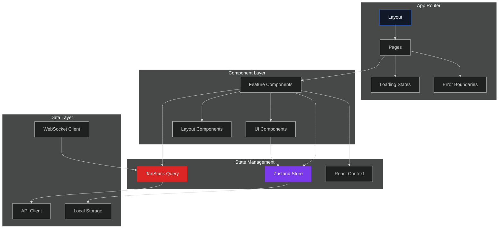
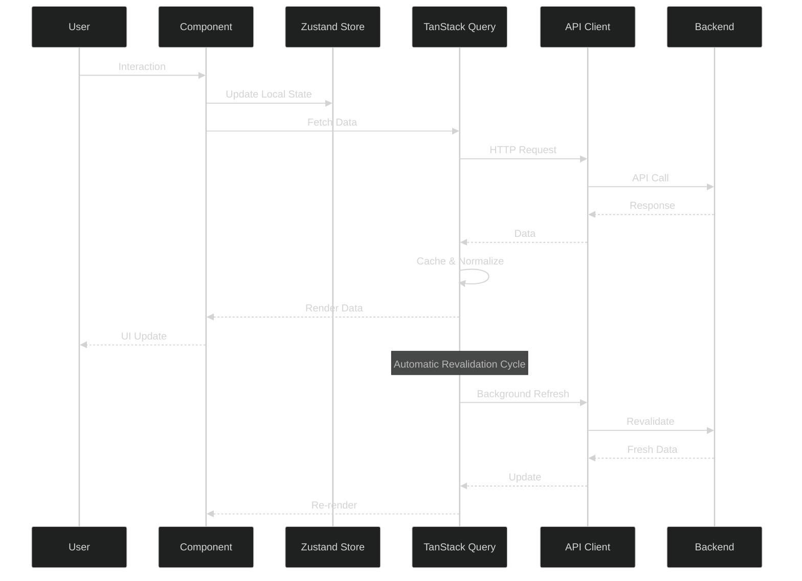

# 🎨 EduSynth Frontend

### Next.js 16 Modern Educational Platform Interface

**A cutting-edge, performant, and accessible frontend for AI-powered educational content generation with stunning animations and interactive visualizations.**

---

## 📚 Table of Contents

* [🌟 Features](#-features)
* [🏷️ Architecture](#-architecture)
* [🚀 Getting Started](#-getting-started)
* [💻 Development](#-development)
* [📁 Project Structure](#-project-structure)
* [🎨 Styling Guide](#-styling-guide)
* [🧩 Component Library](#-component-library)
* [🚀 Deployment](#-deployment)

---

## 🌟 Features

### ⚡ Performance & Modern Stack

* **Next.js 16 App Router**: Server-side rendering and streaming
* **React 19**: Latest concurrent features and optimizations
* **TypeScript**: Full type safety across the application
* **Tailwind CSS 4**: Utility-first styling with custom design system
* **Edge Runtime Ready**: Optimized for Vercel Edge deployment

### 🎨 Rich User Experience

* **Smooth Animations**

  * GSAP for complex timeline animations
  * Framer Motion for React component animations
  * CSS-based micro-interactions

* **Interactive Visualizations**

  * React Flow / XYFlow for mind maps and flowcharts
  * Real-time content updates
  * Drag-and-drop interfaces

* **Responsive Design**

  * Mobile-first approach
  * Tablet and desktop optimizations
  * Adaptive layouts for all screen sizes

### 🔍 Advanced Features

* **Real-time Content Generation**: Live progress tracking with TanStack Query
* **Code Highlighting**: Syntax highlighting with Highlight.js
* **Markdown Rendering**: Rich markdown support with remark-gfm
* **Dark Mode**: System-aware theme switching
* **Accessibility**: WCAG 2.1 AA compliant
* **Progressive Web App**: Offline-capable with service workers

### 🔒 State Management

* **Zustand**: Lightweight global state management
* **TanStack Query**: Server state and caching
* **React Context**: Feature-specific local state
* **URL State**: Shareable app states via query parameters

---

## 🏗️ Architecture

### Component Architecture

### Data Flow

---

## 🚀 Getting Started

(Installation, Development, and Deployment steps remain same as provided)

---

## 📧 Support

* 🐛 [GitHub Issues](https://github.com/varunaditya27/EduSynth/issues)
* 📧 Email: [varun.paparajugari@gmail.com](mailto:varun.paparajugari@gmail.com)
* 💬 [Discussions](https://github.com/varunaditya27/EduSynth/discussions)

---

**Built with Next.js ⚡ | Styled with Tailwind 🎨 | Powered by React ⚛️**

